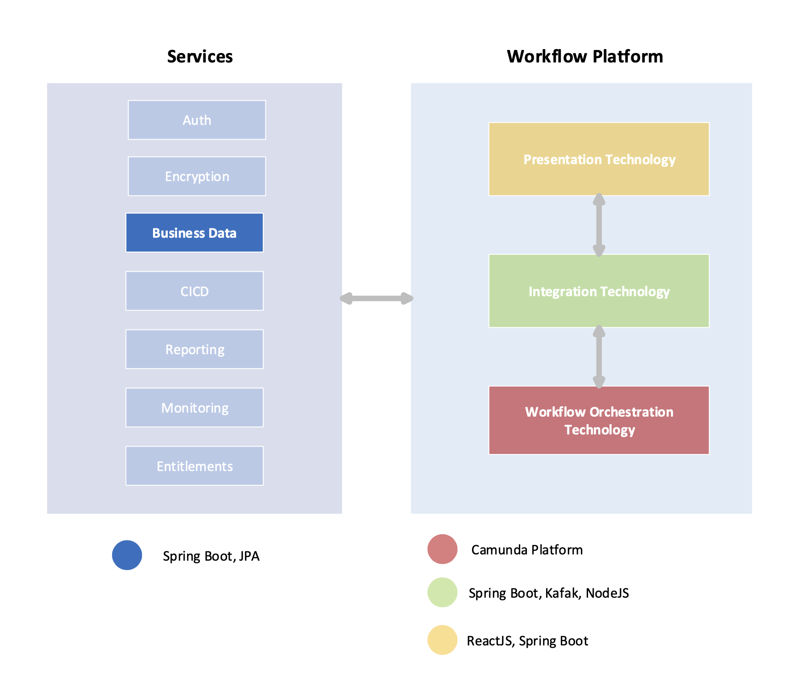

# Camunda Demo Starter

The purpose of this project is to have a starter for a custom demo. This enables a developer to quickly spin up a partially customized demo or go deeper and create highly customized demo. Additionally it provides a framework that maintains best practices for development and architecture and demonstrates common concepts and patterns.

## Project Goals

- Support quick startup of OOTB components for advanced demo of custom BPMN
- Maintain development and architecture best practices for reference
- Support development modes for each project for quick modification
- Support integration with common technologies K8s, Kafka, SMTP, LDAP …
- Support adding new components in a structured and flexible pattern

## Quick Start

Follow the steps below to use Docker Compose to quickly start a fully functioning Camunda environment (either version 7 or version 8).

- Create a new directory named `camunda-demo`

  ```bash
  mkdir camunda-demo
  ```

* Change into this new directory. (All steps below assume you are in this new `camunda-demo` directory)

  ```bash
  cd camunda-demo
  ```

* [Authenticate to the Github container registry](https://docs.github.com/en/packages/working-with-a-github-packages-registry/working-with-the-container-registry#authenticating-to-the-container-registry)

  ```bash
  docker login ghcr.io -u username -p PAT
  ```

* Now jump to either [Camunda 8](#Camunda-8) or [Camunda 7](#Camunda-7) sections below.

---

## Camunda 8

* Clone the `Camunda Platform` project into your local `camunda-demo` directory.

  ```bash
  git clone https://github.com/camunda/camunda-platform.git
  ```

* Clone this project (the `camunda-demo-starter` project) into your local `camunda-demo` directory.

  ```bash
  git clone https://github.com/camunda-consulting/camunda-demo-starter.git
  ```

* Start a Camunda 8 environment from your `camunda-demo` directory

  ```bash
  cd camunda-demo
  ```

  ```bash
  docker-compose \
                -f ./camunda-demo-starter/docker-compose.postgres.yml \
                -f ./camunda-demo-starter/docker-compose.data-api.yml \
                -f ./camunda-demo-starter/docker-compose.reactjs.yml \
                -f ./camunda-demo-starter/docker-compose.smtp.yml \
                -f ./camunda-platform/docker-compose-core.yaml \
                -f ./camunda-demo-starter/docker-compose.c8.yml \
                -f ./camunda-demo-starter/docker-compose.c8-dmn.yml \
                up -d --build
  ```

#### After the environment starts up, access each of the components like so:
- camunda-react: http://localhost:3000
- operate: http://localhost:8081
    - username/password: demo/demo
- tasklist: http://localhost:8082
- TODO: optimize isn't currently included .. should we include it as part of default? optimize: http://localhost:808?
- c8-client: http://localhost:9012
- data-api: http://localhost:9000
- camunda-postgres: localhost:5432
  - username/password: camunda/camunda
- zeebe: localhost: 26500

### C8 - How to customize

#### Deploy Process Diagrams

Process diagrams are deployed through Camunda desktop modeler or web modeler

[Start and view a workflow in C8 SaaS](https://docs.camunda.io/docs/guides/orchestrate-human-tasks/#start-and-view-your-process-instance)

For Self-Managed use Camund Desktop Modeler to deploy the process. Simply click the radio button and target Self Managed. The endpoint is already configured to the default.

#### How to use the C8 Client

- Start a workflow

- Connect to mock services

  - E-Mail
  - Business Data

- Correlate Message

- Connect to real services

  Connecting to real services such as Salesforce or a your real data will require use of a C8 client. See below for more on C8 Clients and the external worker pattern.

  [Build your own C8 Client](https://docs.camunda.io/docs/apis-clients/overview/)

  [Extend the existing spring-boot C8 Template](https://github.com/camunda-consulting/camunda-8-poc-template) update the docker-compose.c8.yml to point to your local copy of the c8 client template. Note you can start with the [original template](https://github.com/camunda-community-hub/camunda-8-process-solution-template) instead of the forked poc template.

---

### Camunda 7

* Clone this project (the `camunda-demo-starter` project) into your local `camunda-demo` directory

  ```
  git clone https://github.com/camunda-consulting/camunda-demo-starter.git
  ```

* Start a Camunda 7 environment

  ```
    docker-compose  \
               -f ./docker-compose.postgres.yml \
               -f ./docker-compose.data-api.yml \
               -f ./docker-compose.smtp.yml \
               -f ./docker-compose.c7.yml \
               -f ./docker-compose.c7-client.yml \
               -f ./docker-compose.reactjs.yml \
               up -d --build
  ```

#### After the environment starts up, access each of the components like so:

- camunda-react: http://localhost:3000
- operate: http://localhost:8082 (TODO: verify this)
    - username/password: demo/demo
- data-api: http://localhost:9000 (TODO: verify this)
- optimize: http://localhost:8082 (TODO: verify this)
- tasklist: http://localhost:8081 (TODO: verify this)
- camunda-postgres: localhost:5432
    - username/password: camunda/camunda

## C7 - How to customize

#### Deploy Process Diagrams

Process diagrams are deployed through Camunda desktop modeler or with the Spring Boot app

- See [Camunda Modeler](https://camunda.com/download/modeler/) to deploy process through the REST api.

- Run the [C7 environment](#Camunda-7)


---

## How to customize other components

### Add Custom Data

Two entities exist and work with the prebuilt demo (User and Case). They are pre loaded with data. In many cases you need to add some custom data. See following link for more ...

[Adding Data Model to Data API](https://github.com/camunda-consulting/camunda-demo-data#readme)

### Prebuilt Custom UI

The custom UI is using ReactJS. The UI serves the purpose of demonstrating the capability to integrate a Custom UI into a workflow. It is not an exhaustive example of what it possible.

The Custom UI is dependent on the [Data API Project](https://github.com/camunda-consulting/camunda-demo-data#readme)

See the docs on the [ReactJS Demo Project](https://github.com/camunda-consulting/camunda-demo-ui#readme) for more on modifying the UI

[See ReactJS Project](https://github.com/camunda-consulting/camunda-demo-ui#readme)

### Modify a component (Like the C8 Client)

Typically every component has a docker-compose.<<component-name>>.yaml. It is configured to build and run a docker image.

Each component can be run on the CLI or through the IDE as a Spring-Boot project. When modifying a component this option will be the easiest strategy and will allow you to work quickly in development mode supported by the project. To run in this mode clone the repo into your parent directory and then modify the docker-compose to build locally.
```
c8-client:
  container_name: c8-client
  #image: ghcr.io/camunda-consulting/camunda-8-poc-template:latest
  use to build from local process-solution-template
   build:
     context: ../camunda-8-process-solution-template
```
[See more about modifying specific projects in the project README](#components)

### Add a new component

You can build your component and integrate it with docker and docker-compose or you can just run your app on your local machine and utilize the other components / apps through the local network bridge by simply starting the existing apps you require with docker-compose.

For more advanced integration you can publish your app to docker hub or github packages and then add a docker-compose.<<component-name>>.yaml to the project. An example would be creating a new app for UI presentation or creating a new c8 worker with the [template](https://github.com/camunda-community-hub/camunda-8-process-solution-template).

- Decide which existing components you want to leverage like the Data API
- Create your app in your preferred technology
- Publish the package
- Create a docker-compose.<<component-name>>.yaml to integrate your app into the demo-starter

See the docker-compose.reactjs.yaml as an example.

---

## Architecture

The diagram generically depicts the components and how they interact.



## Components

### camunda-demo-starter

This camunda-demo-starter is focused on glueing together reusable components for mimicking business data services, integration services, and front end UI’s. This reduces the time it takes to build demos. It also provides examples of proven, consistent, reusable system design patterns.

### camunda-8-poc-template

[C8 Spring Boot PoC Template](https://github.com/camunda-consulting/camunda-8-poc-template)

C8 PoC Spring Boot client has some basic workers built in the can be used OOTB within BPMN service tasks.

- email
- mock
- get-user

See more here on [Camunda worker clients](https://docs.camunda.io/docs/apis-clients/overview/)


### camunda-7-run

C7 Run leverages Spring-Boot framework with an embedded Camunda engine. This project has a many extensions and customizations that can be leveraged.

[C7 Camunda Run](https://docs.camunda.org/manual/7.17/user-guide/camunda-bpm-run/)

### camunda-demo-c7-client

Abstraction layer for C7 external task worker and REST controller

[C7 Spring Boot Cleint](https://github.com/camunda-consulting/camunda-demo-c7-client)

### camunda-data-api

Multipurpose Mock API used for UI Data, Business Data and other

[Mock Data Api](https://github.com/camunda-consulting/camunda-demo-data#readme)

### camunda-react

Demo ReactJS app to start process and complete tasks.

[camunda-reactjs-demo](https://github.com/camunda-consulting/camunda-demo-ui#readme)

<!--
//### camunda-dmn-worker
//
//TODO: link to github and short description
//
//### Authentication and Authorization
//
//TODO: describe using identity for securing the data api and rest apis?
-->
---

## Presentation Slide Template

[Proof of Technology Google Slides Template](https://docs.google.com/presentation/d/1fI7mdW_Q6yEiM0H01b58aQVa74YkTnYj/)

---
## How to contribute to this project

- Read the documentation on each project below.
- Fork the project from github into a new repository and checkout into a local project directory.
- Each project contains a README describing how to setup a development environment and make code changes.
- Make your changes and work in your fork.
- If you have a contribution that isn't specific to a customer create a pull request on the project

---

## How to create an issue

[Create an issue](https://github.com/camunda-consulting/camunda-demo-starter/issues/new/choose) in the project for feature requests and bugs.

---


[](https://github.com/Camunda-Community-Hub/community/blob/main/extension-lifecycle.md#proof-of-concept-)

<!-- [](https://github.com/Camunda-Community-Hub/community/blob/main/extension-lifecycle.md#incubating-) -->
