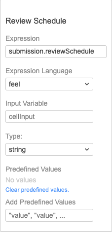

=== Best Practice - Modeling BPMN and DMN

==== BPMN Best Practices and Examples
- Business modeling with https://cawemo.com/[Cawemo]
- Technical Modeling with https://camunda.com/download/modeler/[Camunda Modeler]
- Framework to https://bpmn.io/[customize modeling experience]
- Understand https://github.com/camunda/camunda-modeler/tree/master/docs/element-templates[Element Templates] for configuring modeling experience
- https://camunda.com/best-practices/building-flexibility-into-bpmn-models/[Modeling best practices]
- Understand https://github.com/camunda/camunda-modeler-plugins[Modeler Plugins]

==== DMN Best Practices and Examples
- https://camunda.com/dmn/[DMN Basics]
- https://camunda.com/dmn/[This is a quick primer on DMN]
- https://docs.camunda.org/manual/7.15/reference/dmn/[DMN reference]
- https://docs.camunda.org/manual/7.15/reference/dmn/decision-table/[Basics of configuring DMN]
- https://camunda.github.io/feel-scala/docs/reference[Reference to feel]
- https://docs.camunda.org/manual/latest/user-guide/dmn-engine/feel/type-handling/[In the weeds here on Date Types]
- https://consulting.camunda.com/dmn-simulator/[DMN Simulator]

===== DMN Examples

*Working with Variables*
====
- Using the `Expression` input to evaluate an Object(JSON or Java)

NOTE: The Expression field is evaluated using FEEL and `.` operator is utilized to access the value of `submission.reviewSchedule`. The `submission` object is stored in Camunda process variables as JsonValue type.  DMN knows how to work with this type. See more about the [JsonValue type]
====
====
- Passing variable through a DMN
====

*Working with Dates*
====
* Date formats best practice
** Use DateTime with timezone
** Camunda process variable format(java.util.Date) vs Feel DateTime Format
====

*A working example*
====

====