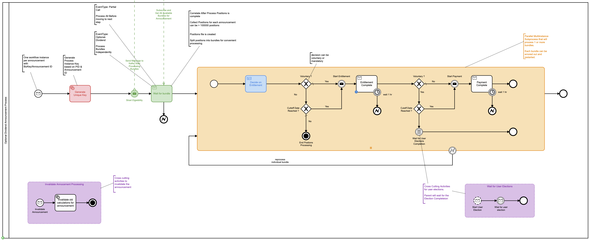

## Use Case: Corporate Actions Processing Announcements

### Summary
The objective of this PoC is to create an example workflow for processing Corporate Action Announcements. An example of an announcement is a change to an equity that holders of the equity can take action upon.

Announcements are processed in batches by services that handle much of the heavy lifting preparing and bundling the announcement for further and more detailed processing. The primary role of the workflow is track and orchestrate the precessing and potentially handle errors and incidents when they occur.

An announcement can have one or more bundles, depending on the type of event. The system generates the bundles and decides how to split the bundles and sends one or more bundles to the workflow. The workflow will orchestrate and track the completion of announcements interacting with the different services in an asynchronous manner. Additionally, the workflow will orchestrate the re-processing of specific announcements through bundles. Effectively reprocessing a bundle when needed. If an announcement changes the process can be terminated and the current announcement state is invalidated. Additionally the process leaves open the opportunity for a

### Goals
- [x] Processing large volumes
- [x] Bulk parallel processing announcements
- [x] Integration with Kafka
- [x] Handling errors, incidents and retries
- [x] Handling data in the workflow
- [x] Tracking and visibility

### Workflow

The workflow is started by an announcement event on the event bus. A subscriber can pick up the announcement event and start the process by triggering the start event. Additionally, a unique key must be generated to associate an announcement and bundles to a workflow instance. Ths unique key will allow correlation of events in future steps in the workflow.

To start Eligibility processing a Message Send Event is configured to publish the event to Kafka and start Eligibility processing. Once Eligibility processing is complete the (Wait for Bundles) step is correlated with the Bundles generated in the Eligibility service. One or more bundles are passed to the Sub-process (Orange). The sub-process is configured with Parallel Multi-instance marker allowing a collection of bundles to be passed into the sub-process. For each item in the collection the sub-process is executed in parallel. Meaning that the Camunda engine will attempt to get all the bundles to the first wait state (Eligibility Complete) as quickly as possible.

Once in Edibility Complete state each bundle can be processed independently, as well as error handling can be triggered for each bundle. The message activity (Eligibility Complete) is configured with local variables so as to create a unique correlation for each bundle in the sub-process. This pattern is then repeated for subsequent steps.

Workflow variables passed to the process at different stages control the flow of the process potentially moving the process state through Voluntary or Mandatory paths.

Event based sub-process allow for invalidation of the current announcement effectively killing the process for the respective announcement. This can happen when a new announcement is made for the same announcement ID. Additionally, user elections can be started and tracked by the User Elections event sub-process at any point in the processing of announcement.

NOTE: User Election can make for an interesting PoC to better understand user interactions with the workflow. But was beyond the scope of this PoC.

*Error handling* in the process is done from a couple of perspectives. Firstly and most clearly Error events are triggered based on timeout of services. When a service such as Entitlement fails to correlate the Message event in the workflow the timer is triggered based on the configured timeout. Thus triggering a error throw event and allowing the modeler to control the flow fo the process and in this case restarting the processing of the specific bundle.

The other aspect of error handling is related to creating explicit wait states in the process also know as Asynchronous Continuations. Importantly we use this feature at the beginning of the bundle processing sub-process for a couple reasons. First to process the bundles in parallel we have to persist the state of the process and allow the Camunda job executor to move each bundle sub-process to the first wait state (Entitlement Complete). Second if a bundle fails we will not roll the process state back to the previous step (Wait for Bundles) instead we will potentially have an incident in the sub-process that we can handle at that place in the process.

As discussed, error handling has implication on how and where you store business data that is associated to the workflow and may require the rehydration of business data upon failure or retry.

==== Processing Large Volumes
The sub-process is mostly responsible for tracking and processing the announcements. The main goal of the sub-process, defined as a *Parallel Multi-instance Sub-process* is to get the workflow instance to the first wait state as fast as possible for n number of bundles passed into the sub-process. This is done using the Job Executor and defined in the process with *Asynchronous Continuation*, which essentially means that we create a save point in the workflow and Camunda will handle the execution of this savepoint. Additionally the savepoint is defined as *Exclusive*. This means that the Camunda engine will attempt to get each sub-process from the savepoint to the first wait state as fast as possible on a single thread. Multi-treading can be enabled if there is an explicit need by unchecking *Exclusive*, only doing this if testing shows it it truly necessary.

WARNING: Take note, this pattern can be reused for bulk processing and is viable under the correct circumstances. It is not the only possibility for bulk processing. Potentially other designs could prove more effective for this or other use-cases.

### Integration Summary

//<<ui-integration, UI Integration>> - The integrations with the UI are REST based. Starting, retrieving, completing tasks and workflows are done through the <<camunda-rest-api,Camunda REST API>>.

//Technical integrations like email integration is done through <<patterns-for-integration,Camunda delegates and listeners>>. When a user task is started an email is sent to the user.

//Kafka integration is done through spring-eventing-bridge and spring-clould-streams framework for the purpose of sending Camunda event information to other systems i.e. BI reporting solutions. See <<send-and-recieve-pattern, Patterns for Integration with BPMN>> and <<kafka-integration,Kafka Integration example>>

Kafka integration is done through spring-clould-streams framework for the purpose of sending Camunda event information to other systems i.e. Eligibility, Entitlement, Payment, etc ... See <<send-and-recieve-pattern, Patterns for Integration with BPMN>> and <<kafka-integration,Kafka Integration example>>

REST integration is done with postman and provides examples of diving and interacting with the workflow through the Camunda REST API.

More on all these topics in later sections.

### See it running

IMPORTANT: See more on <<running-the-usecase,running the use case>>

IMPORTANT: See more on <<using-springboot-profiles, using profiles>>

### Important Considerations

- Understand <<pre-launch-concepts, Pre Lauch Concepts>>
- Understand https://docs.camunda.org/manual/latest/user-guide/process-engine/history[Camunda History]
- Understand https://docs.camunda.org/manual/latest/modeler/element-templates/[Element Templates]
- Understand https://docs.camunda.org/manual/latest/user-guide/process-engine/transactions-in-processes/[Transactions in Workflow]
- Understand https://camunda.com/best-practices/performance-tuning-camunda[Performance Tuning with Camunda]
- Understand https://docs.camunda.org/manual/latest/user-guide/process-engine/error-handling/[Error Handling]