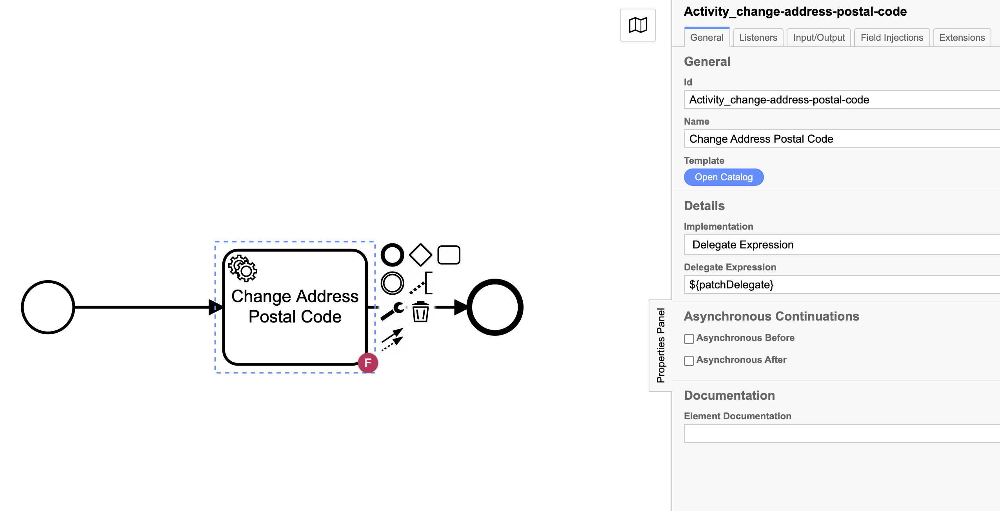
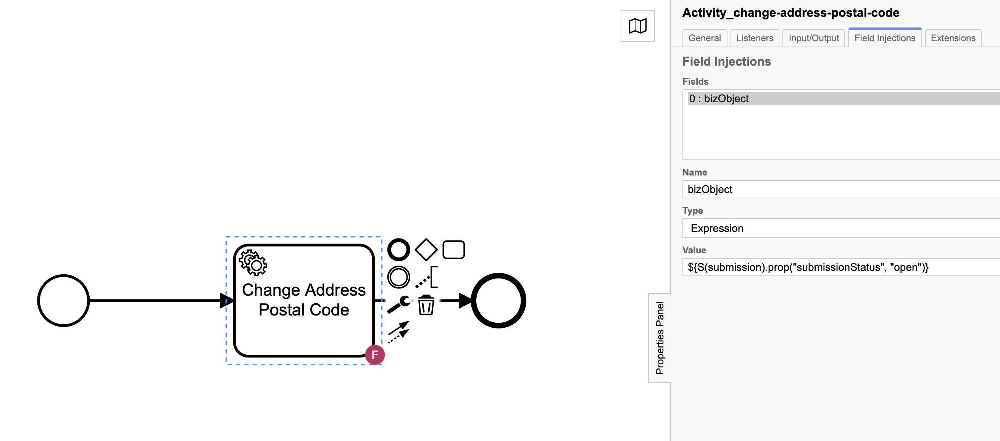

= Updating JSON in Camunda with reusable code and config
Doc Writer <paul.lungu@camunda.com>
v1.0, 2021-11-27
:toc: right

//=== [[example-camunda-field-injection-json-update]] Example: Updating a Typed JSON Object Camunda variable with an expression in field injection

This is an example of updating an JSON object that is stored in Camunda as a process variable with an Expression by Field Injection.

IMPORTANT: What's neat about this approach or pattern is it allows us to write a generic handler to update any Json object and update this object in a simple and elegant way.

https://docs.camunda.org/get-started/[Get started quick go to the guide here].

==== Start a process with a Json typed object
====
Let's assume we have created an Address variable in Camunda. This can be done through the REST api or Java api.

TIP: POST to the Camunda start process api http://localhost:8080/engine-rest/process-definition/key/<process-key>/start the body of the post is below

*Json Body (serialized as Spin Typed Json Object, persisted as BLOB)*
```JSON
  {
    "variables": {
        "address":
        {
            "value":"{\"type\": \"PostalAddress\",\"addressLocality\": \"Denver\",\"addressRegion\": \"CO\",\"postalCode\": \"80209\",\"streetAddress\": \"7 S. Broadway\"}",
        "type":"Json"
        }
    }
  }
```
https://docs.camunda.org/manual/latest/user-guide/data-formats/json/#native-json-variable-value[Storing JSON Typed Value]

https://docs.camunda.org/manual/latest/user-guide/process-engine/variables/#typed-value-api[Storing Typed Value]
====

==== Create and configure a generic reusable JavaDelegate
====

*Use a bit of Java code in a Camunda Java Delegate to get the Object and eventually do something with the updated object*

In this case I send a PATCH request to the business API to update the object in the business store.

```Java

/**
 * This is an easy adapter implementation
 * illustrating how a Java Delegate can be used
 * from within a BPMN 2.0 Service Task.
 * Spring-bean can be accessed as a Delegate Expression
 */
@Component("patchDelegate")
public class PatchDelegate implements JavaDelegate {

  //inject the value of the busines data API
  @Value("${data.api.uri}")
  String dataApiUri;

  //get the dynamic object to be updated from the field injection
  private Expression bizObject;

  private final Logger LOGGER = Logger.getLogger(Class.class.getName());

  //the overriden interface of java delegate
  public void execute(DelegateExecution execution) throws Exception {

      //Get the updaed business object passed in by the field injection
      JacksonJsonNode bizObj = (JacksonJsonNode) bizObject.getValue(execution);
      //Access and maniputle properties if the JSON object
      Integer id = (Integer) bizObj.prop("id").numberValue();
      bizObj.deleteProp("id");

      LOGGER.info(" \n\n ====>> Biz Object: " + bizObj.toString() + "\n");

      //Your business logic goes here ...
      //Use fluent HTTP api to execute PATCH request to business API
      String request = Request.Patch(dataApiUri + "/submissions/"+id)
              .bodyString(bizObj.toString(), ContentType.APPLICATION_JSON)
              .execute().returnResponse().toString();

      LOGGER.info(" ====>> Response \n" + request);
  }
}

```

*Configure the Java Delegate using a BPMN service task to be called by the workflow execution*

Use a Delegate Expression to call our JavaDelegate `${patchDelegate}`

====

==== Create the field injection configuration
====
*Create a field injection using the Address Json object*

Configure a field injection to

- Pass in the Json Address object to our JavaDelegate.

 The Name field is used to bind to the property in the JavaDelegate. Additionally we use a generic name calling it `bizObejct` so we can reuse this Delegate for any Camunda variable.

- Use an expression to update the Json Address before it's handled by the Java delegate

 The Exression field is used to update the Json object dynamiclly in conjuction with Camunda Spin library. Since we already stored the Address object as a Json Typed variable Camunda Spin can now manipulte the Address easily.

 Again this use of the expression is elegant and reusable allowing us to potentially update any property or object we need.

*Expression*
```
${S(address).prop("postalCode", "80026")}
```


====

==== Recap
====
What happened to our Address object?

- The workflow is stated with a POST request body and Address JOSN object.
- The `Change Address Postal Code` step is executed and the JavaDelegate is called during the execution.
- The postal code was changed by simply executing the Expression with Spin in the Field Injection. `${S(address).prop("postalCode", "80026")}`
- The use of the field injection and java delegate config allows us to access and use the updated JSON Address object.

```JSON
  {
    "type": "PostalAddress",
    "addressLocality": "Denver",
    "addressRegion": "CO",
    "postalCode": "80209",
    "streetAddress": "7 S. Broadway"
  }
```
NOTE: the postalCode is mutated
```JSON
  {
    "type": "PostalAddress",
    "addressLocality": "Denver",
    "addressRegion": "CO",
    "postalCode": "80026",
    "streetAddress": "7 S. Broadway"
  }
```

====


==== More on storing and interacting with variables and expressions

https://docs.camunda.org/manual/latest/user-guide/data-formats/json/#expression-language-integration[Interacting with  variables in expressions]

//<<best-practice-handling-business-data, Handling Busines Data in Workflow>>

https://camunda.com/best-practices/handling-data-in-processes/[Understanding Business Data in Workflows]

https://camunda.com/best-practices/enhancing-tasklists-with-business-data/[Understand how to scale business data in Camunda]

https://camunda.com/best-practices/performance-tuning-camunda/#_common_pitfalls_with_variables[Common pitfalls when storing process variables]

https://docs.camunda.org/manual/latest/user-guide/data-formats/data-formats-in-processes/[Data Formats]

https://docs.camunda.org/manual/latest/user-guide/data-formats/json[JSON Data Formats]

https://docs.camunda.org/manual/7.15/user-guide/process-engine/variables/#supported-variable-values[Supported Variables]

https://docs.camunda.org/manual/7.15/user-guide/process-engine/variables/#transient-variables[Transient Variables]

