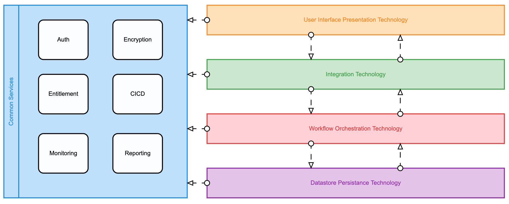

## Architecture

==== Architecture and Engine Basics

- Camunda platform installation options
** Spring-boot
** Tomcat Servlet and other
** https://docs.camunda.org/manual/7.16/installation/
- Camunda Platform and REST API Architecture
** https://camunda.com/wp-content/uploads/2020/09/TB-Camunda_Reference_Architecture-092520.pdf[Camunda architecture]
** https://docs.camunda.org/manual/7.16/user-guide/process-engine/multi-tenancy/[Camunda Multitenancy Official Doc]
- https://github.com/camunda/docker-camunda-bpm-platform[Camunda Docker] image and docs
- https://github.com/camunda-community-hub/camunda-helm/tree/main/charts/camunda-bpm-platform[Camunda Kubernetes] with HELM
- https://github.com/camunda/docker-camunda-bpm-platform[Official Camunda Docker Image]
- https://github.com/camunda-community-hub/camunda-helm/tree/main/charts/camunda-bpm-platform[Official Camunda HELM Chart]
- https://hub.docker.com/r/camunda/camunda-bpm-platform[Docker HUB Camunda Platform] see tags for options
- https://github.com/plungu/camunda-helm[forked opinionated HELM chart]
- See https://docs.camunda.org/manual/7.15/introduction/supported-environments/[Supported Environments] to ensure the right infra is chosen
- https://docs.camunda.org/manual/latest/update/[Upgrade Path and Practice]
//- Blue green deployment with camunda

---

==== Generic Workflow Platform Architecture

The architecture depicted below generically demonstrates the possibilities and patterns interacting with the workflow. It's worth noting this is not an exhaustive model for interacting with the workflow, merely possible approaches and patterns that can be generally applied.

====
- The orange box signifies components that present data and ux to clients.

- The green bar signifies integration and abstraction technologies that help implement advanced patterns, interactions and glue systems together.

- The red box represents workflow and orchestration technology like Camunda.

- The blue boxes signify components that do specific work and are potentially interact with different layers of a workflow platform

- Purple box underlies the data persistance technology the workflow engine requires to keep the state of the workflow.

NOTE: An important takeaway is that different patterns for interactions with the workflow are possible and often desirable. It can make sense to have a orchestrated approach in some cases and a choreographed approach in other cases within the same workflow or broader use-case.

NOTE: This is a typical pattern for workflow architectures though the level of abstraction between components will vary from use-case to use-case.
====

### Architecture Patterns
//#### COMMAND
//====
//Spring REST controllers can be used to post data to the workflow. Simple and concise API's are defined should be deifned for interaction with the process. See `WorkflowController.java` The API always takes an object and returns and HTTP Status. The RESTful endpoint context mapping is associated to Commands that can happen in the system. Such as START, APPROVE and REJECT and intended to work in a point-to-point(request/response) synchronous fashion.
//
//The controllers only write POST/PUT data CREATING and UPDATING only.
//====
//TIP: The intention is to create a https://martinfowler.com/bliki/CQRS.html#:~:text=CQRS%20stands%20for%20Command%20Query,you%20use%20to%20read%20information[CQRS(Command Query Responsibility Segregation)] pattern for interaction. This can increase scalability while reducing complexity in distributed systems. The takeaway is to create data-stores that are optimized for different types of interactions primarily writing and reading.
//
//#### QUERY
//====
//A separate API and logically separate data-store is used to query business data. Updates to this data-store always happen in an asynchronous fashion. For example when a Approval task in the work flow completes the workflow publishes an UPDATE-SERVICE-REQUEST event. The subscriber reads the event and decides what to do. In certain cases it updates the object in the data-store. Other components can now read from the data-store such as the UI.
//
//We can guarantee the data is published to the data store with the workflow. See the section above on the JavaDelegates that implement the publishing functionality.

//https://spring.io/blog/2011/02/10/getting-started-with-spring-data-jpa[Spring Data JPA] is the technology used for the ServiceRequest data. Spring Data allows for an easy way to create API's that are easy for a UI to query. Also an easy way to combine data into a useful form for the UI to consume.
//====

==== Orchestration
A human or machine step in a process workflow is directly managed by the workflow.

==== Choreography
A human or machine step in a process workflow is indirectly correlated to the workflow.

==== External Task
Camanda has developed a unique pattern to allow ployglot programming with the Camunda engine and decouple work from the engine execution. See https://camunda.com/best-practices/invoking-services-from-the-process/#_understanding_and_using_strong_external_tasks_strong[External Tasks Doc]

==== SAGA
Orchestration of complex technical activities is a common pattern with BPMN and Camunda engine. It's possible to orchestrate SAGA's so that compensation and rollback can happen in a distributed transaction.

==== Request Response
Send and receive synchronous requests to and from the workflow is possible and a common approach for integration.

==== Pub/Sub
Publish and subscribing to messages and events from a queue or topic is natural and useful pattern when working with workflow. Camunda can integrate with any such technology including Kafka, AMQP, JMS and more.

==== Abstraction Integration
It's important to integrate with other systems such as UI, entitlement, authorization and authentication, as well as other legacy systems. To meet this requirement it's often desirable to have an abstraction layer around Camunda. This abstraction layer can include several different technologies include custom REST API's, Kafka, API aggregation tools like MuleSoft, GraphQL, caching technologies such as Hazelcast and others depending on your use-case. There really is no limitations with Camunda.

==== CQRS
Applying CQRS is a common practice with workflow technology. Though Camunda doesn't necessarily implement CQRS pattern Camunda can participate in an architecture that emphasises CQRS approach.

=== [[poc-tech-stack-infra]]PoC Tech Stack and Infra
- SpringBoot
- Java
- ReactJS
- Camunda Platform
- Docker
- Kubernetes
- Kafka
- Postgresql