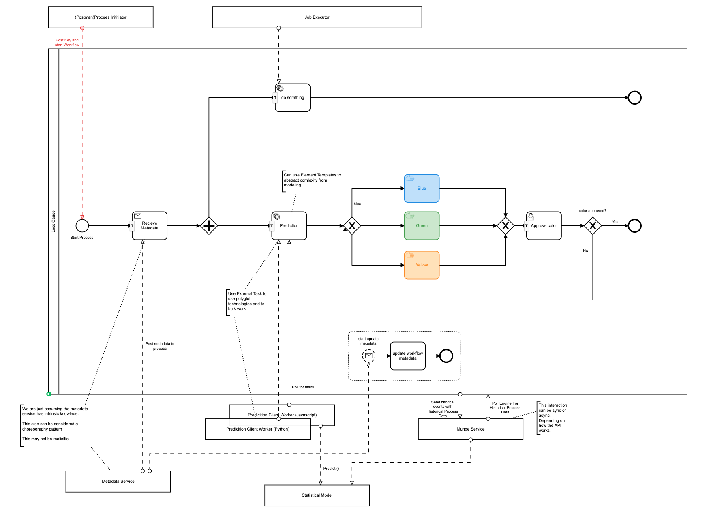
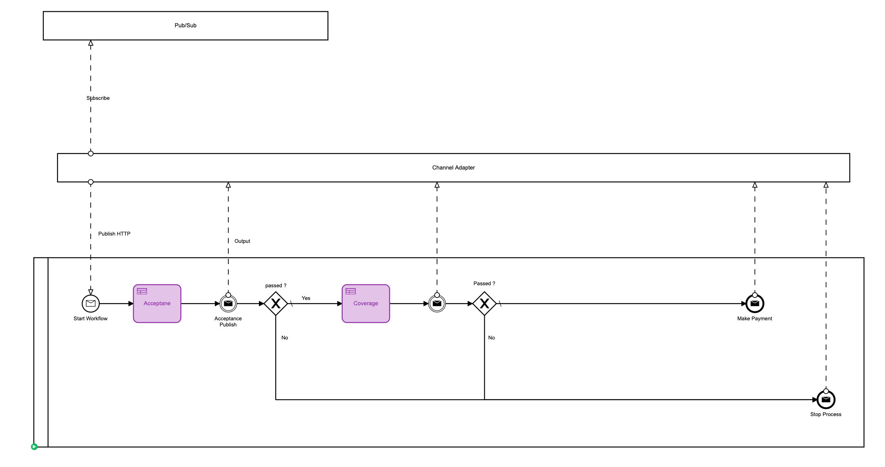

=== Summary
The purpose of the PoC was to achieve a better understand of Camunda Engine, BPMN and DMN standards and how to apply them.
Achieve understanding of mechanics deploying Camunda in Google Cloud environment. Also understand options for developing with Camunda by setting up local environments. Two use-cases were modeled, the *water backup process* with BPMN and DMN for example of integrating DMN rules, Channel Adapters and Fabric payload. Additionally, the *loss cause process* was modeled to understand process history and how to utilize history to train machine learning models.

=== Goals
- [x] Setup environments and infra to understand mechanics of Camunda deployment and development process
- [x] Execute Business rules based on Fabric payload
- [x] Integration with HTTP Channel Adapter and CSOR (Note) pub/sub topics
- [x] Understand how Camunda, BPMN and DMN fit into Fabric and overall architecture
- [x] Understand Camunda Cockpit
- [x] Understand how to utilize History to train stats model
- [x] Understand options to use Camunda variables and store Fabric meta-data

=== Use Case - Loss Cause Workflow
====
Loss Cause process demonstrates interacting with a predictive model. Once the process has been initiated using an HTTP request it then waits to receive a META model. Once revieved, the process branches on two parrallel paths. On the main path an <<external-tasks, External task>> is configured, a python worker uses the external task API to fetch, lock and complete prediction tasks. Predictions set the `color` variable and sends the process down the correct path. In this example a User Task is configured to approve the prediction and potentially correct the prediction. Once the process is complete the *Munge* Service can use the Camunda History API to update the machine learning model.
====

=== Use Case - Water Backup Workflow
====
The Water Backup process is demonstrating interacting with Business Rules(DMN) and Pub/Sub via Channel Adapters. The workflow will initially be started Via a channel adapter performing an HTTP POST request to the Camunda REST API. Then a DMN table will be executed by Camunda and outputting the result for the Rule that hit. Different paths in the workflow will be taken depending on the output of the Rule. Finally a message is published back to a Channel Adapter from the workflow.
====

=== Integrations

===== Google Pub/Sub and Channel Adapter Workflow Integration
====
Google Pub/Sub *publishing* integration from the Camunda perspective is implemented through <<patterns-for-integration, Java Delegates>> or <<patterns-for-integration, Execution Listerners>> and Java code executed in the workflow execution context.

Camunda BPMN Message Receive events are also utilized in the workflow context to receive messages from the pub/sub.

Abstraction from the workflow implementation and the pub/sub framework is accomplished through the *Channel Adapter* concept. The channel adapter concept utilizes HTTP to publish to the workflow Message Receive API and the workflow Camunda Delegates and/or excution listeners will utilize HTTP to publish to the channel adapters.
====

===== Machine learning integration
====
Interacting with the predictive model was done use a polyglot programming pattern called <<external-tasks, External Task Pattern>> this allowed the integration with the predictive model to be programmed in Python and the interaction with the Camunda External Task API ot use HTTP.

Feeding the predictive model was discussed and is prefaced by understanding Camunda History and how to access Camunda History. An example of querying Camunda history through the API was implemented.

NOTE: Other methods to integrate with Camunda History are possible. See <<history-enigne-plugin, History Engiine Plugin>> and <<spring-eventing-bridge,Spring Event Brindge>>.

====

===== Using Camunda variables to store Fabirc meta-data
====

The main takeaway being that we have several options to store data in Camunda.

- Store just an id and load the data into transient variable. In this scenario history of variables is not stored.
- Store the entire meta-data model as a blob and accessible using JSON Spin
- Store only the needed meta-model for the domain. You can parse the meta-model in Camunda or outside. If in Camunda you can use <<workflow-execution, Execution Listener>> combined with an https://github.com/camunda/camunda-bpm-examples/tree/master/process-engine-plugin/bpmn-parse-listener[engine plugin parse listener] or the <<spring-eventing-bridge, Camunda Spring Eventing Bridge>>.

See the section on <<example-camunda-storing-variables,storing variables>>

====

=== See It Running
A portion of the PoC was dedicating to building and running an environment specific to American Family and is not documented in this document. Though many of the steps and examples are documented. See the section below for concepts about running these environments and the specifics for Camunda.

Additionally, we spent time running with Docker Tomcact Image and Spring-Boot for local development.

===== Running Local Dev
- <<example-camunda-docker-tomcat,Run the Camunda Tomcat Docker Image>>
- <<example-camunda-docker-springboot,Run Camunda Spring-Boot with Docker>>
- <<example-camunda-helm,Run Camunda HELM>>
- <<best-practice-securing-db-connection,Configuring a SSL/TLS connection from Camunda application to Postgres Database>>

=== Important Considerations
- Understand <<pre-launch-concepts, Pre Lauch Concepts>>
- Understand https://docs.camunda.org/manual/latest/user-guide/process-engine/history[Camunda History]
- Understand https://docs.camunda.org/manual/latest/modeler/element-templates/[Element Templates]
- Understand https://docs.camunda.org/manual/latest/user-guide/process-engine/transactions-in-processes/[Transactions in Workflow]
- Understand https://camunda.com/best-practices/performance-tuning-camunda[Performance Tuning with Camunda]
- Understand https://docs.camunda.org/manual/latest/user-guide/process-engine/error-handling/[Error Handling]
- Understand https://camunda.com/services/training/[Training]
- Understand https://camunda.com/best-practices/building-flexibility-into-bpmn-models/[Modeling Best Practices]
- Understand https://cawemo.com/[Business Modeling]
- Understand https://github.com/camunda/camunda-modeler-plugins[Modeler Plugins] & https://github.com/camunda-community-hub[Camunda Community Hub]
- Understand https://docs.camunda.org/manual/latest/reference/rest/[REST API]
- Understand https://docs.camunda.org/enterprise/download[Camunda Downloads]
- Understand https://docs.camunda.org/manual/latest/user-guide/process-applications/maven-archetypes/#overview-of-available-maven-archetypes[Quick Project Setup with Mavan]
- Understand https://docs.camunda.org/manual/latest/reference/rest/openapi/[Camunda Open API]
- Understand https://pypi.org/project/camunda-external-task-client-python3/[Community Python External Task Client]

