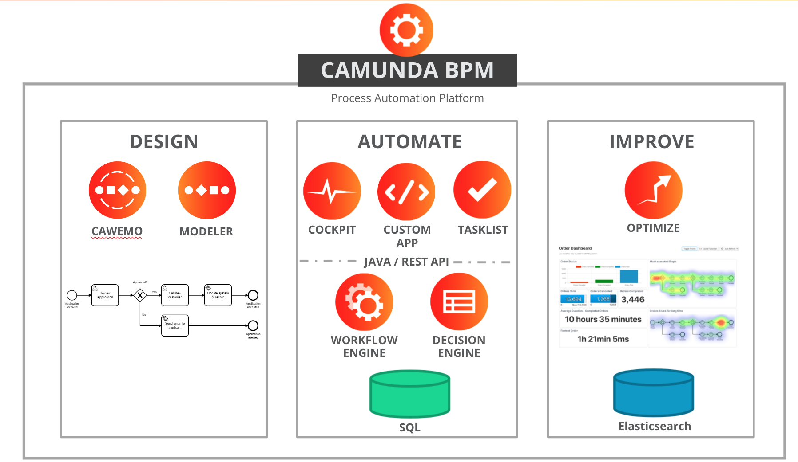

=== FDA PoC Workshop
====
- Engagement Date:		November 8th, 2021
- Customer Project:     Evaluate Camunda
- Camunda Contact:
** Paul Lungu[paul.lungu@camunda.com]
** Garth Knudson[garth.knudson@camunda.com]
** Joe Pappas[joe.pappas@camunda.com]
====

=== Summary
The purpose of the workshop is to discuss and demonstrate Camunda concepts and to generally enable FDA team to evaluate Camunda and eventually modernize business process with Camunda.

=== Preparation for PoC

IMPORTANT: Preparing for a PoC is important. Please follow the points below to ensure that we can get a smooth and productive start to the PoC Workshop.

- [x] Confirm goals are acceptable <<poc-goals, See Poc Goals>>
- [x] Confirm agenda is within scope <<poc-agenda, See PoC Agenda>>
- [ ] Contact info for primary contact on FDA side
- [ ] Provide Infrastructure Guidelines for PoC <<poc-tech-stack-infra, See PoC Infra Section>> and confirm Infra for PoC
- [ ] Confirm integrations for Poc. <<poc-integrations, See PoC Integrations Section>>
- [ ] Provide Name and Email of participants several days prior to the start of the PoC
- [ ] Block time of participants in Calendars
- [ ] Send out invitations to all participants
* If hands on sessions are planned download all the tools or confirm access to saas tools
** [ ] https://camunda.com/download/modeler/[Download Camunda Modeler]
** [ ] Confirm Access to https://cawemo.com/[Cawemo] - Invitations to the project will be sent out from Cawemo.com

=== [[poc-goals]] Goals
- [ ] Understand and demonstrate flexibility, reuseablility, and agility with Camunda lifecycle design, execution and improvement.
** [x] Deep dive hands-on modeling BPMN and DMN
** [ ] Deep dive hands-on for key technical deliverables
** [ ] Demonstrate low barier to productivity and light learning curve for devs
** [ ] Understand Camunda LifeCycle and related agile principles
- [ ] Understand transparent change management with Camunda
- [ ] Demonstrate a process running in Camunda engine
- [ ] Demonstrate capability to monitor and handle exception and incidents in business process orchestrations
- [ ] Demonstrate integration patterns with BPMN, Camunda and other technologies to enable third party integrations
- [ ] UI integration to demonstrate technical concepts interacting with Camunda engine
- [ ] Discuss architectural concepts related to Infra, Design, Modeling and Patterns
- [ ] Understand how Camunda Platform, BPMN and DMN fit into overall architecture
- [ ] Understand reporting with Camunda demo with Optimize
- [ ] Deliver key documentation to ensure best practices in scope of PoC

=== [[poc-agenda]]Agenda (Draft)

[cols="1,1,1,1"]
|===
|Date | Hours | Description | Responsible

|Nov 8, 2021
|80 Total Estimated
|PoC Start
|FDA and Camunda

|Nov 8, 2021 - 10am EST
|1
|<<workshop-1, Workshop 1>>

FDA present use case, project overview

Camunda to provide short intro to the Camunda Platform
|FDA and Camunda

|Nov 8, 2021 - 11am EST
|4
|<<workshop-1, Workshop 1>>

Camunda and FDA Hands on Modeling BPMN with Cawemo Biz Modeler

|FDA and Camunda

|Nov 8, 2021 - 3pm EST
|2
|<<workshop-1, Workshop 1>>

Camunda and FDA Hands on Modeling DMN Business Rules
|FDA and Camunda

|Nov 9, 2021 - 10am EST
|3
|<<workshop-2, Workshop 2>>

Technical modeling and deploying the DMN and BPMN to Camunda.

|FDA and Camunda

|Nov 10, 2021 - 10am EST
|3
|<<workshop-3, Workshop 3>>

Camunda and FDA hands on technical walk-through

Setting up a process application and deploying locally with Camunda, Docker and Kubernetes.

Understanding Architecture Basics

|FDA and Camunda

|Nov 12, 2021 - 10am EST
| 3
|<<workshop-4, Workshop 4>>

Camunda and FDA hands on technical walk-through

Understand Development and Integration patterns

|FDA and Camunda

|Oct 15, 2021 - 10am EST
| 2
|Demo Preparation Contingency Discussion
|Camunda and FDA

|Nov 17, 2021 - 10am EST
|2.5
|PoC DEMO Dry Run
|Camunda and FDA

|Nov 19, 2021 - 10am EST
|2.5
|PoC DEMO
|Camunda and FDA

|===

==== [[workshop-1]]Workshop 1 - Camunda Platform, Modeling BPMN

===== *Agenda*:  Quick Walk through of Camunda Platform, Hands on business modeling with BPMN and DMN

- Camunda *process automation life-cycle* lends itself well to agile and iterative design principles. Camunda provides powerful and flexible tools in each phase of the life-cycle allowing process designers, developers, workflow operators and business analysts to effectively create, code, operate and analyse business process from start to finish.

** *Design Phase* business and it collaboration with Cawemo and Desktop Modeler
** *Automate and Execute Phase* technical and operational execution of process, interaction with process from operational and end user standpoint
** *Improvement Phase*

==== Modeling
- Business modeling with https://cawemo.com/[Cawemo]
- Technical Modeling with https://camunda.com/download/modeler/[Camunda Modeler]
- Framework to https://bpmn.io/[customize modeling experience]
- https://github.com/camunda/camunda-modeler/tree/master/docs/element-templates[Element Templates] for configuring modeling experience
- https://camunda.com/best-practices/building-flexibility-into-bpmn-models/[Modeling best practices]
- https://camunda.com/dmn/[DMN Basics]

==== [[workshop-2]]Workshop 2 - Executing and Operating Workflow
===== Agenda: Technical modeling and deploying the DMN and BPMN to Camunda. Understanding cockpit and engine basics
- Techincal Modeling making a workflow executable
- https://camunda.com/products/camunda-platform/cockpit/[Camunda Cockpit]

==== Engine Fundamentals
- Understanding https://docs.camunda.org/manual/7.15/user-guide/process-engine/transactions-in-processes/[Transactions and Thread Control]
- Understand https://docs.camunda.org/manual/7.15/user-guide/process-engine/history/[Camunda History, Audit and Cleanup]
//**  https://docs.camunda.org/manual/7.15/user-guide/process-engine/database/database-schema/[Database Schema]

==== [[workshop-3]]Workshop 3 - Project Setup, Tech Stack, Deployment and Architecture
===== Agenda: Setting up a process application and deploying locally with Camunda, Docker and Kubernetes. Understand architecture basics.

- Camunda platform installation options
** Spring-boot
** Tomcat Servlet and other
** https://docs.camunda.org/manual/7.16/installation/
- Camunda Platform and REST API Architecture
** https://camunda.com/wp-content/uploads/2020/09/TB-Camunda_Reference_Architecture-092520.pdf[Camunda architecture]
** https://docs.camunda.org/manual/7.16/user-guide/process-engine/multi-tenancy/[Camunda Multitenancy Official Doc]
- https://github.com/camunda/docker-camunda-bpm-platform[Camunda Docker] image and docs
- https://github.com/camunda-community-hub/camunda-helm/tree/main/charts/camunda-bpm-platform[Camunda Kubernetes] with HELM
- https://github.com/camunda/docker-camunda-bpm-platform[Official Camunda Docker Image]
- https://github.com/camunda-community-hub/camunda-helm/tree/main/charts/camunda-bpm-platform[Official Camunda HELM Chart]
- https://hub.docker.com/r/camunda/camunda-bpm-platform[Docker HUB Camunda Platform] see tags for options
- https://github.com/plungu/camunda-helm[forked opinionated HELM chart]
- See https://docs.camunda.org/manual/7.15/introduction/supported-environments/[Supported Environments] to ensure the right infra is chosen
- https://docs.camunda.org/manual/latest/update/[Upgrade Path and Practice]
//- Blue green deployment with camunda

==== [[workshop-4]]Workshop 4 - Development and Integration Patterns
===== Agenda: Understand development and integration patterns

//==== Integration Patterns
//* AMQP Pub/Sub
//* Async Messaging
//* Synchronous service tasks REST
//* External Tasks

//Additionally, we spent time running with Docker Tomcact Image and Spring-Boot for local development.
//
//- https://plungu.github.io/camunda-react-springboot-example/index.html[camunda-poc-starter ordering usecase]
//===== Running Local Dev
//- <<example-camunda-docker-tomcat,Run the Camunda Tomcat Docker Image>>
//- <<example-camunda-docker-springboot,Run Camunda Spring-Boot with Docker>>
//- <<example-camunda-helm,Run Camunda HELM>>
//- <<best-practice-securing-db-connection,Configuring a SSL/TLS connection from Camunda application to Postgres Database>>

---
=== Use Case - Submission Review

==== Workflow
====
*In Progress ...*
====

=== [[poc-integrations]] PoC Integrations
====
*In Progress ...*
====

//* [ ] Pub/Sub with workflow
//** Messaging through Kafka
//* [ ] Integration with Salesforce
//** Creation, update and deletion of case/object
//* [ ] Notification and Validation
//** Twilio SMS
//** Email Integration
//** Camunda Element Template for Quick Configuration of Integration
//* Mock CreditCard integrations
//* [ ] UI integrations
//** Start workflow from UI and message interaction
//** Complete work based on async notification to third party by choreographing the user experience

